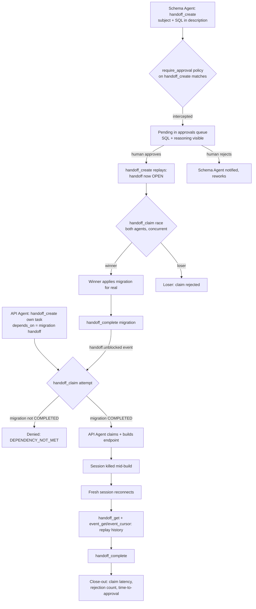

# nexus-brownfield-handoff-demo

**Target codebase:** [`gothinkster/node-express-realworld-example-app`](https://github.com/gothinkster/node-express-realworld-example-app) — the official Node/Express/TypeScript backend from the RealWorld project, using Prisma ORM against PostgreSQL, JWT auth, real migration tooling.

This is the self-serve, forkable version of the demo: `git clone`, run a handful of scripts, and you'll have reproduced the whole scenario on your own machine — not just read about someone else having run it.

---

## About Nexus

Okto Nexus is a local-first coordination layer for teams running multiple AI coding agents — it runs on your own machine, no account required. It doesn't write code or specs. It governs how agents claim work, hand it to each other, get gated by policy, and get approved by a human before anything risky ships.

Instead of two agents stepping on each other, or a human manually relaying context between chat windows, Nexus gives every agent a shared, durable coordination bus with structural rules: who owns a task, what needs a human sign-off, and what's excluded until its dependencies are done.

Nexus is architecturally and operationally independent of Okto Pulse — no import, network call, config flag, or service reference connects the two. Pulse is only a design precedent Nexus's visual style and a few naming conventions were mirrored from.

---

## The Problem

AI agents are good at doing work. They're not naturally good at *not doing the same work twice*, *not touching something risky without asking*, or *remembering what happened after a session dies*:

- **Two agents can claim the same task.** Without a single-winner rule, both proceed, and now there are two conflicting implementations of the same thing.
- **Risky actions ship because nobody was asked.** A schema change, a delete, a deploy — if nothing pauses it for a human, "the agent decided to" is the whole audit trail.
- **A dependency nobody enforces is a suggestion.** A rule that only warns doesn't stop an agent from building against a schema that doesn't exist yet.
- **Coordination context dies with the session.** Kill an agent mid-task and whoever picks it up next is starting from zero.

This repo runs a real feature end to end — split across two independent agents — to see whether Nexus's handoffs, approval policies, and dependency graph actually close these gaps.

---

## The Feature

Rate-limiting for the RealWorld API, plus an admin endpoint reporting rate-limit metrics — split across two agent identities connected to the same Nexus workspace:

- **Schema Agent** — proposes and applies the database migration
- **API Agent** — builds the admin metrics endpoint, dependent on the migration existing

## How It Works

1. **Schema Agent proposes the migration.** It calls `handoff_create` with the subject and the migration SQL in the description. Because an operator has attached a `require_approval` policy to Schema Agent's `handoff_create` calls, this doesn't create the handoff immediately — Nexus intercepts it into the approvals queue instead.

2. **A human approves it.** The pending proposal sits in the dashboard (or `scripts/04_list_and_approve.py`) with the full SQL and Schema Agent's reasoning visible. Approval re-executes the original call — the handoff now exists, `OPEN`, claimable.

3. **The handoff is claimed and the migration applied.** Nexus's atomic claim guarantees a single winner if more than one agent is eligible — see the note below on why this repo's migration handoff is deliberately left unrestricted so the race is real. The claimant applies the migration for real against the target app, then marks the handoff complete.

4. **API Agent's own task depends on the migration.** Its handoff for the admin endpoint is created with `depends_on` set to the migration handoff. If it's not yet `COMPLETED`, any claim attempt is refused with `DEPENDENCY_NOT_MET` — no code gets written against a schema that doesn't exist yet.

5. **Once unblocked, API Agent builds the endpoint** — for real, following the existing codebase's route and auth conventions — and completes its handoff.

6. **Durability under failure.** A claimed-but-unfinished task survives a killed session: a fresh connection with no prior context can recover exactly what was claimed and what already happened, purely from Nexus's own record, and finish the work.

7. **Close-out.** A small script reads the event log directly to report claim latency, rejection counts, and time-to-approval for the run.

### A note on the claim race

An earlier run of this demo scoped the migration handoff's `target` to `role: api`, which meant only one agent was ever eligible to claim it — collapsing the "race" to a single claimant. `scripts/03_schema_agent_propose.py` in this repo deliberately leaves `target` unrestricted, and `scripts/05_claim_race.py` fires both agents' `handoff_claim` calls concurrently via `asyncio.gather`, so a fresh run here actually exercises the single-winner guarantee instead of assuming it.

---

## Architecture



---

## Repository Structure

| Path | Purpose |
|---|---|
| `README.md` | This document |
| `app/` | Forked Node/Express/Prisma backend (`gothinkster/node-express-realworld-example-app`) |
| `app/FORK_NOTES.md` | Fork setup notes |
| `docker-compose.yml` | Postgres for the target app |
| `.env.example` | Every env var the scripts need — copy to `.env`, fill in, never commit the filled version |
| `scripts/lib/nexus_client.py` | Shared MCP client helper — no hardcoded keys or IDs anywhere in this repo |
| `scripts/00_setup_nexus.sh` | Installs + starts Nexus, enables `feature_dag`/`feature_hitl`/`feature_verification` |
| `scripts/01_register_agents.py` | Registers fresh `schema-agent`/`api-agent` identities, prints their keys |
| `scripts/02_bind_policy.py` | Creates + binds the `require_approval` policy on Schema Agent's `handoff_create` |
| `scripts/03_schema_agent_propose.py` | Stage 1 — the gated proposal |
| `scripts/04_list_and_approve.py` | Stage 2 — list/decide pending approvals over REST |
| `scripts/05_claim_race.py` | Stage 3 — both agents claim concurrently |
| `scripts/06_api_agent_dependent.py` | Stage 4 + part of stage 6 — dependent handoff, early-denial, later claim |
| `scripts/07_complete_and_unblock.py` | Stage 5 — winner completes the migration handoff |
| `scripts/08_kill_and_recover.py` | Stage 6/7 — claim, get killed, recover from a fresh process |
| `docs/decisions/` | Fork conventions read before either agent touched the codebase (Prisma/PostgreSQL, JWT auth, `nx`-based build) |
| `docs/prompts/` | Per-stage prompts for whichever coding agent writes the actual feature code, plus `closeout.py` |
| `docs/walkthrough.md` | Clone-to-finished, stage by stage, copy-pasteable |
| `docs/nexus-in-action/` | Real screenshots (add your own after running it — see that folder's README) |

---

## Roles

| Identity | Can do | Cannot do |
|---|---|---|
| Schema Agent | Proposes the migration (SQL in the handoff description), races to claim it once approved, applies it | Cannot approve its own `handoff_create` — that's a human-only decision once the policy intercepts it |
| API Agent | Proposes its own dependent task, races to claim the migration, builds the endpoint once unblocked | Cannot claim its own handoff while the migration handoff isn't `COMPLETED` |
| Operator (human, dashboard/REST) | Attaches the `require_approval` policy; approves/rejects pending proposals | N/A — has no MCP identity of its own beyond the reserved `operator` agent |

Two separate MCP connections, separate credentials — structural separation, not a shared identity switching hats.

---

## Tools Used

| Tool | Used for |
|---|---|
| `handoff_create` | Schema Agent proposes the migration (gated by policy); API Agent proposes its dependent task |
| `handoff_claim` | Both agents race on the migration; API Agent's early (denied) and later (allowed) claim on its own task |
| `handoff_complete` | Closing out each task |
| `handoff_get` / `event_get` / `event_cursor` | Recovering state after a session interruption; close-out timing |
| `artifact_put` | Optionally recording applied SQL as an artifact — not policy-gated (`require_approval` only attaches to `handoff_create`/`message_create`, confirmed live) |

Policy and guardrail administration (attaching `require_approval`, approving/rejecting) is dashboard/REST-only — deliberately not exposed to agents, so an agent can never grant its own exception.

---

## Prerequisites

| Requirement | Notes |
|---|---|
| Python 3.11+ | `pip install "okto-nexus[serve]"` |
| Node.js 18+ | Required by the target app |
| Docker | For `docker-compose.yml`'s Postgres (or point `DATABASE_URL` at your own) |
| Two separate agent connections | Schema Agent, API Agent; do not share credentials — `scripts/01_register_agents.py` creates fresh ones per run |
| `feature_dag` enabled | Required for `depends_on` to be enforced — `scripts/00_setup_nexus.sh` sets this |

---

## Quickstart

```bash
git clone <this-repo>
cd nexus-brownfield-handoff-demo-repo
python3 -m venv .venv && source .venv/bin/activate
pip install -r scripts/requirements.txt
cp .env.example .env

docker compose up -d

export NEXUS_PROJECT_ROOT="$(pwd)"
bash scripts/00_setup_nexus.sh
python3 scripts/01_register_agents.py   # copy the printed keys into .env
export $(grep -v '^#' .env | xargs)
python3 scripts/02_bind_policy.py
```

Full stage-by-stage run: **[`docs/walkthrough.md`](docs/walkthrough.md)**.

---

## Stage-by-Stage Execution Plan

| Stage | What happens | Script / prompt |
|---|---|---|
| 0. Setup | Install + start Nexus, register agents, bind the approval policy | `scripts/00_setup_nexus.sh`, `01_register_agents.py`, `02_bind_policy.py` |
| 1. Propose (gated) | Schema Agent calls `handoff_create` for the migration, SQL in the description — intercepted into the approvals queue | `scripts/03_schema_agent_propose.py` / `docs/prompts/01-schema-agent-propose.md` |
| 2. Approve | Human approves; the migration handoff is now `OPEN` | `scripts/04_list_and_approve.py` |
| 3. Claim race | Both agents attempt `handoff_claim` concurrently; exactly one wins | `scripts/05_claim_race.py` |
| 4. Early-claim denial | API Agent's dependent handoff is refused with `DEPENDENCY_NOT_MET` until the migration completes | `scripts/06_api_agent_dependent.py create` / `docs/prompts/03-api-agent-dependent-task.md` |
| 5. Apply + complete | The migration is applied for real, then marked complete | `docs/prompts/02-schema-agent-apply-migration.md`, `scripts/07_complete_and_unblock.py` |
| 6. Unblock + build | API Agent claims its now-unblocked handoff and builds the admin metrics endpoint | `scripts/06_api_agent_dependent.py claim` / `docs/prompts/04-api-agent-build-endpoint.md` |
| 7. Session kill + recovery | A killed session's replacement recovers full state from Nexus and finishes the task | `scripts/08_kill_and_recover.py` / `docs/prompts/05-recovery.md` |
| 8. Close-out | Reports claim latency, rejection count, and time-to-approval from the real event log | `docs/prompts/closeout.py` |

---

## Results

Two separate live runs back this repo:

**Run 1 — the original feature build.** Produced the real code sitting in `app/` right now:

- **Migration:** the `RateLimitEvent` Prisma model plus its generated `migration.sql`, in `app/src/prisma/`
- **Admin endpoint:** `GET /api/admin/metrics` (`app/src/app/routes/admin/admin.controller.ts`), registered in the app's router
- **Tests:** `admin.metrics.spec.ts`

That run's claim race was accidentally uncontested (see "A note on the claim race" above), and its coordination steps were driven by hand, not by the scripts in this repo — those didn't exist yet.

**Run 2 — validating this repo's scripts, end to end, against a fresh isolated Nexus instance and a fresh Postgres database** (no docker on the machine that validated this, so a native Postgres install stood in for `docker-compose.yml`'s container — same effect, different transport). Every stage in the table above was executed for real via the actual `scripts/*.py` files, not simulated:

```json
{
  "handoffs_created": 2,
  "handoffs_claimed": 2,
  "handoffs_completed": 2,
  "claim_latency_seconds": [7.05, 12.61],
  "avg_claim_latency_seconds": 9.83,
  "time_to_approval_seconds": [31.49],
  "rejection_count": 0
}
```

The claim race in this run **was** genuinely contested — `schema-agent` and `api-agent` both called `handoff_claim` concurrently on a `broadcast`-target handoff, `schema-agent` won, `api-agent` got a real `HANDOFF_ALREADY_CLAIMED` response. `rejection_count: 0` isn't a miss here, though: a losing race attempt returns an error to the caller but doesn't emit a `handoff.rejected` *event* on the handoff — that event type is for something else (an explicit reject action), not a lost race. `docs/prompts/closeout.py` counts events, so a race with a real loser still correctly reports `0` there; don't read that field as "no contention happened."

Dependency enforcement (`DEPENDENCY_NOT_MET`) fired exactly as designed on the early claim attempt, and recovery was proven by handing a `CLAIMED` handoff to a brand-new script invocation with no shared memory, which reconstructed full state via `handoff_get` + `event_get` before completing it.

### What running it for real actually caught

Every one of these was invisible from reading the scripts — each only surfaced by executing them against a live server:

- `handoff_create` names its caller field `from_agent_id`, not `agent_id` like every other handoff tool — confirmed by pulling the real tool schema via `list_tools()`, not guessed.
- `target` and `visibility` are **required** on `handoff_create` (no "unrestricted" default) — the "broadcast" strategy is what actually makes the claim race real.
- `artifact_put` takes `artifact_type` (`"text"`/`"file"`/`"json"`/`"markdown"`), not the `content_type` I'd invented.
- The very first handoff/event call against a workspace Nexus hasn't seen before fails with a cryptic `DB_ERROR: FOREIGN KEY constraint failed` unless `workspace_resolve` has been called first. Now baked into `scripts/lib/nexus_client.py` so every script does this automatically.
- Nexus reports application-level failures (a lost claim race, a denied dependency) as a normal successful MCP response whose JSON body is `{"ok": false, ...}` — not as an MCP-protocol error. The client originally only checked the protocol-level error flag, which meant a **losing** claim-race attempt was silently logged as a win. Fixed in `nexus_client.py`; this is the one that would have made the demo's own headline claim (single-winner races) look true when it wasn't actually being checked correctly.
- `scripts/00_setup_nexus.sh` now passes `--home` to scope this demo's data to the repo clone — the default `~/.okto_nexus` is shared across every Nexus instance on a machine, which would otherwise mix this demo's agents into an unrelated one's data.

### A finding worth repeating

During that run, the connected `api-agent` session **fabricated three `handoff_complete`/`handoff_get` responses in a row** — a phantom workspace ID, a phantom dependency — while the underlying file work was genuinely done. It was caught only by independently calling the real MCP server directly instead of trusting the session's self-report. That's why `scripts/` in this repo does every coordination call deterministically (no LLM in that loop) and why every prompt in `docs/prompts/` explicitly tells the agent to verify its own claims against a real tool response rather than reporting what it expects to have happened. Nexus's event log is what caught it the first time; nothing else in the loop did.

---

## Conclusion

Built on Okto Nexus, an OktoLabs product. Structural separation between proposing, approving, claiming, and executing — enforced by the coordination layer itself, not a prompt either agent has to remember to follow.
